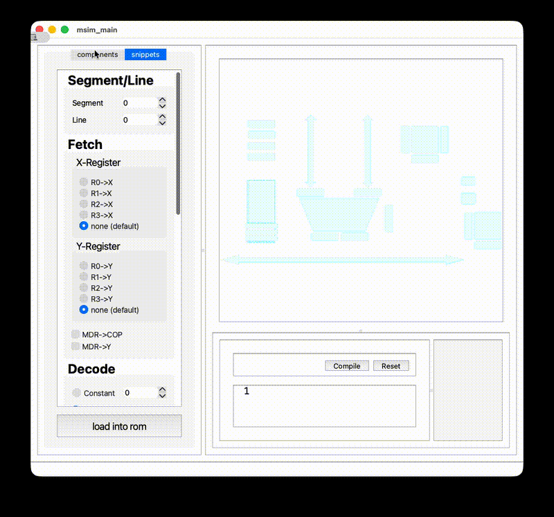
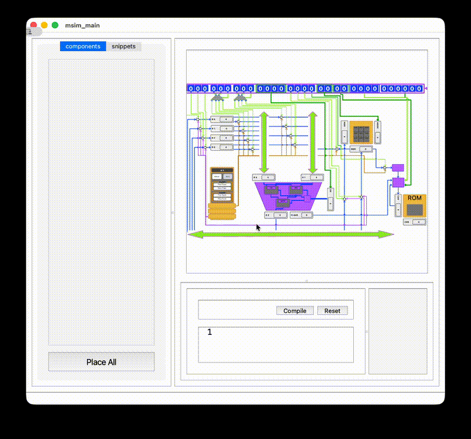
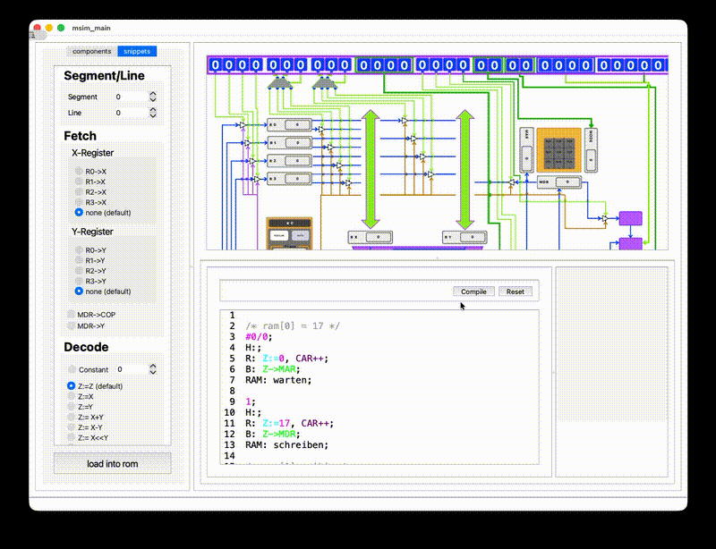

# MICROSIMULATION

### Overview

MICROSIMULATION is an educational software tool designed to support the learning and
understanding of basic CPU architectures and microcode execution. The application allows
students to construct a simplified processor architecture, write and execute microcode
instructions, and observe internal data flows and state changes in a visual and interactive
manner. The primary goal of the software is to make abstract concepts of computer architecture
tangible by enabling step-by-step execution and direct interaction with architectural components.

### Features

**Interactive Architecture construction**

- Manual placement of registers, buses, ALU, memory components, etc.
- Automatic architecture generation for faster experimentation

**Microcode execution**

- Write and edit microcode instructions using the built-in editor or the snippet system
- Load microcode into ROM
- Execute instructions step-by-step or automatically
- If there are components missing, the system will inform the user which components are required to run the microcode

**Clock-controlled execution**

- Explicit clock control (single-step and continuous execution)
- Visual feedback for each execution phase
- Visualized control flow
- Highlighted components
- Visualization of register contents and state changes

**ROM and RAM inspection**

- Detailed views for memory contents
- Direct observation of data changes during execution

**Snippet system**

- Predefined snippets to build instructions step by step
- Useful for learning and experimentation or if the syntax is not yet fully understood

**Didactic focus**

- Tooltips and visual cues
- Prevention of invalid component placement
- Supports exploratory learning

### Target Audience

The software is primarily intended for:

- Students in early semesters of computer science or software engineering
- Courses on:
  - Computer architecture
  - Microprogramming
- Self-study and exam preparation
  No prior experience with the tool is required.
  Basic knowledge of CPU architecture is beneficial.

### Usage Concept

1. Build the architecture
2. Manually place components or use automatic layout
3. Write instructions directly or use the snippet system
4. Execute instructions
   - Step through individual phases using the clock
   - Observe internal state changes
   - Analyze behavior
   - Inspect registers, buses, and memory
   - Identify errors or unexpected behavior
   - Experiment
   - Modify microcode
   - Re-run execution
   - Compare results

### Educational Purpose

MICROSIMULATION was developed as a didactic tool, not as a cycle-accurate hardware simulator.
Its primary goals are:

- Supporting conceptual understanding of CPU internals
- Visualizing control flow and data paths
- Encouraging active learning through experimentation
- Reducing cognitive load compared to textual or static representations
- The tool is especially suited for explaining:
  - Microcode execution
  - Register transfers
  - Control signals
  - Instruction sequencing
  - Memory interaction

### Limitations

- The architecture is intentionally simplified
- Not intended for performance evaluation or real CPU modeling
- Focuses on clarity and learning, not hardware completeness
- It is implemented as a prototype
- May contain bugs or incomplete features
- User feedback is welcome for future improvements

### Evaluation

The application was evaluated in a user study with students from different semesters.
Results show (so far):

- High usability (SUS score > 80)
- Strong support for learning and understanding CPU behavior
- Especially helpful for visualizing execution phases and data flow

Common feedback highlighted:

- Good visualization of internal processes
- Helpful tooltips and interaction constraints
- Suggestions mainly concerned UI scaling and visual emphasis

#### Author

Developed as part of a project in the context of software engineering education.
